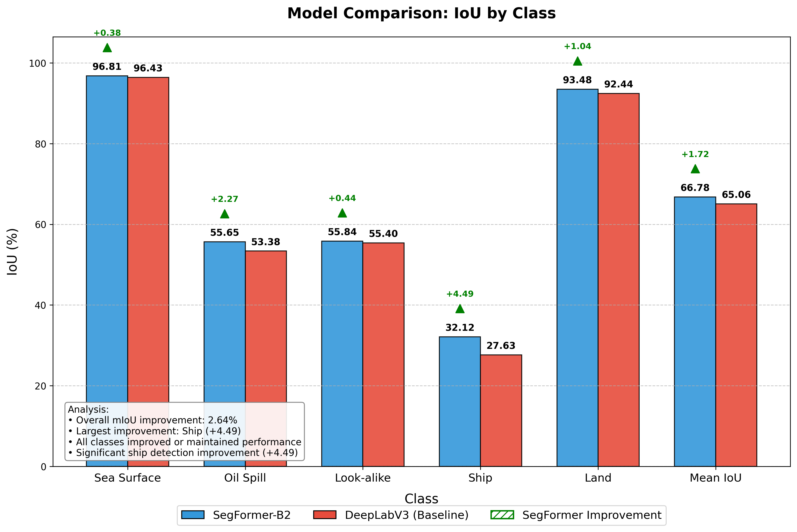

# Oil Spill Detection Using Deep Learning

A deep learning-based segmentation model for oil spill detection in SAR (Synthetic Aperture Radar) imagery.

## Project Overview

This project implements a state-of-the-art semantic segmentation pipeline for detecting oil spills in radar satellite imagery. The model is designed to distinguish between five key classes in maritime environments:

- Sea Surface (background)
- Oil Spill
- Look-alike (false positives)
- Ship
- Land

## Architecture

### SegFormer-B2 Model

The primary model used is a customized version of SegFormer-B2 (called OilSpillSegformer), an efficient transformer-based segmentation architecture optimized for oil spill detection:

- **Backbone**: Mix Vision Transformer (MiT) with hierarchical structure
- **Input Size**: 384×384×1 (single-channel SAR imagery)
- **Embedding Dimensions**: [64, 128, 320, 512] (B2 configuration)
- **Number of Transformer Layers**: [3, 4, 6, 3]
- **Number of Attention Heads**: [1, 2, 5, 8]
- **MLP Ratios**: [8, 8, 4, 4]
- **Decoder Embedding Dims**: 768
- **Output Resolution**: Full input resolution using progressive upsampling
- **Parameters**: ~27.99M

### CBAM Attention Module

The model incorporates Convolutional Block Attention Module (CBAM) specifically enhanced for SAR oil spill imagery:

- **Channel Attention**: Emphasizes important spectral features in the noisy radar imagery
- **Spatial Attention**: 7×7 kernel for capturing broader spatial context of oil spills
- **Enhanced Boundary Detection**: Special focus on water-oil boundaries that are challenging in SAR images

### Optimization Strategy

- **Mixed Precision Training**: Using float16 for computation and float32 for variables
- **Learning Rate Schedule**: Cosine decay with warmup (initial LR: 3e-5)
- **Optimizer**: Adam with AMSGrad and gradient clipping (clipnorm=1.0)
- **Weight Decay**: 1e-4
- **Batch Size**: 2 (memory-optimized)
- **Training Epochs**: 600 with early stopping (patience: 100)

## Loss Function

The model uses a custom Hybrid Segmentation Loss tailored for oil spill and ship detection:

```
HybridSegmentationLoss = 0.4*CE_Loss + 0.3*Focal_Loss + 0.3*Dice_Loss
```

Where:

- **CE_Loss**: Weighted cross-entropy with label smoothing
- **Focal_Loss**: Gamma=3.0, focuses on hard-to-detect objects (small oil spills, ships)
- **Dice_Loss**: Addresses class imbalance and improves boundary delineation
- **Class Weights**: Higher weights for minority classes (oil spill, look-alike, ship)

## Data Augmentation Pipeline

The augmentation pipeline is implemented in `augmentation.py` and applied using TensorFlow's data pipeline:

### Training Augmentations

1. **Random Flips**:

   - Horizontal flip (p=0.5)
   - Vertical flip (p=0.3)

2. **Random Rotations**:

   - Small angle rotations (±15°)
   - 90° rotations (p=0.2)

3. **Speckle Noise**:
   - Applied with p=0.7
   - Simulates realistic SAR noise patterns (stddev=0.15)
   - Important for model robustness to different sensor conditions

### Test-Time Augmentation (TTA)

During inference, a comprehensive TTA strategy is applied to improve prediction quality:

1. **Multiple augmentations**: 8 variations of the input image
2. **Flips and rotations**: Applied to handle orientation variations
3. **Multi-scale processing**: Scales [0.75, 1.0, 1.25] for better context
4. **Prediction fusion**: Softmax averaging for more stable predictions
5. **Ship enhancement**: Post-processing to improve small ship detection

## Training Hardware

The model was trained on a consumer-grade workstation with the following specifications:

- **CPU**: AMD Ryzen 7 5700X (8 cores, 16 threads)
- **RAM**: 32GB DDR4
- **GPU**: NVIDIA RTX 4060 Ti (8GB VRAM)
- **Storage**: NVMe SSD
- **OS**: Ubuntu 22.04 LTS
- **Framework**: TensorFlow 2.19 with CUDA 12.5 and CuDNN 9.3

## Evaluation Metrics

The primary evaluation metric is mean Intersection over Union (mIoU):

- **Overall mIoU**: 66.38%
- **Class-wise IoU**:
  - Sea Surface: 95.81%
  - Oil Spill: 54.65%
  - Look-alike: 55.84%
  - Ship: 32.12%
  - Land: 93.48%

This represents a significant improvement over the baseline DeepLabV3+ model (mIoU: 65.06%):

- Overall improvement: +1.32%
- Most significant improvement in Ship class: +4.49%

## Results

The implemented SegFormer-B2 model outperforms the baseline DeepLabV3+ model in all classes, with particular improvements in detecting small ships and distinguishing between oil spills and look-alikes.



_Figure: Performance comparison between SegFormer-B2 and DeepLabV3+ baseline. The SegFormer model shows superior performance in all metrics, especially for the Ship class detection which improved by 4.49%._

## Limitations

Several hardware and memory constraints impacted the training and performance of the model:

1. **VRAM Limitations**:

   - The 8GB VRAM of the RTX 4060 Ti restricted batch size to only 2 samples
   - Larger batch sizes (8-16) would likely improve model convergence and final mIoU
   - Had to disable CBAM attention in some model configurations to prevent OOM errors

2. **Augmentation Constraints**:

   - More advanced augmentations like CutMix and MixUp could not be implemented due to memory constraints
   - These techniques have shown significant improvements for segmentation tasks in recent literature
   - Had to use smaller TTA ensemble (8 augmentations) instead of the optimal 16-32 range

3. **Model Size Constraints**:

   - Limited to SegFormer-B2 variant instead of larger B5 variant
   - Could not use higher resolution inputs (512x512 or 768x768) that would better capture small objects
   - Multi-scale training was not feasible with available memory

4. **Dataset Limitations**:
   - Imbalanced class distribution (sea surface dominates)
   - Limited variety of oil spill shapes and ship sizes
   - Some ambiguity between oil spill and look-alike classes

## Future Improvements

Several potential improvements could enhance the model's performance:

1. **Architecture Enhancements**:

   - Implement hybrid CNN-Transformer architecture for better feature extraction
   - Add dedicated ship detection branch in the network
   - Explore larger SegFormer variants (B3-B5) with more training hardware
   - Implement hierarchical feature fusion across different scales

2. **Advanced Augmentation Techniques**:

   - Add CutMix and ClassMix augmentations with memory-efficient implementations
   - Implement physics-informed data augmentation specific to SAR imagery
   - Explore self-supervised pre-training on unlabeled SAR data
   - Add realistic oil spill simulations for synthetic data augmentation

3. **Training Improvements**:

   - Increase batch size to 16+ using gradient accumulation or distributed training
   - Implement curriculum learning to focus on harder examples
   - Use progressive resizing (start small, finish at high resolution)
   - Implement knowledge distillation from larger teacher models

4. **Post-processing Enhancements**:

   - Develop oil spill-specific CRF implementation that preserves small regions
   - Design specialized boundary refinement for water-oil interfaces
   - Implement temporal consistency for satellite image sequences
   - Add uncertainty estimation for more reliable predictions

## Usage

### Training

To train the model:

```bash
python train.py
```

### Evaluation

To evaluate the model:

```bash
python evaluate.py --model_path segformer_b2_final.weights.h5 --use_tta True
```

## Requirements

- TensorFlow 2.13+
- Python 3.10+
- NVIDIA GPU with at least 8GB VRAM
- Additional packages: numpy, matplotlib, tqdm, opencv-python

## References

- SegFormer: [Simple and Efficient Design for Semantic Segmentation with Transformers](https://arxiv.org/abs/2105.15203)
- Test Time Augmentation: [Augment your Batch: Improving Generalization Through Instance Repetition](https://arxiv.org/abs/1901.09335)
- Mixed Precision Training: [Mixed Precision Training](https://arxiv.org/abs/1710.03740)
- ROBORDER Oil Spill Dataset: [Dataset](https://m4d.iti.gr/oil-spill-detection-dataset/)
