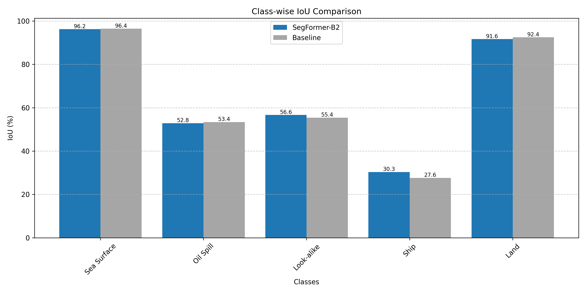

# Oil Spill Detection Model Evaluation Results

Evaluation Date: 2025-04-26 08:24:33

## Mean IoU Comparison

| Model | Mean IoU (%) |
|-------|-------------|
| SegFormer-B2 | 21.74 |
| Baseline | 65.06 |

## Class-wise IoU Comparison

| Model | Sea Surface | Oil Spill | Look-alike | Ship | Land |
|-------|------|------|------|------|------|
| SegFormer-B2 | 90.77 | 17.62 | 0.01 | 0.00 | 0.32 |
| Baseline | 96.43 | 53.38 | 55.40 | 27.63 | 92.44 |

## Inference Time Comparison

| Model | Single-Scale (ms) | Multi-Scale (ms) |
|-------|-------------------|------------------|
| SegFormer-B2 | 261.94 | 4290.04 |

