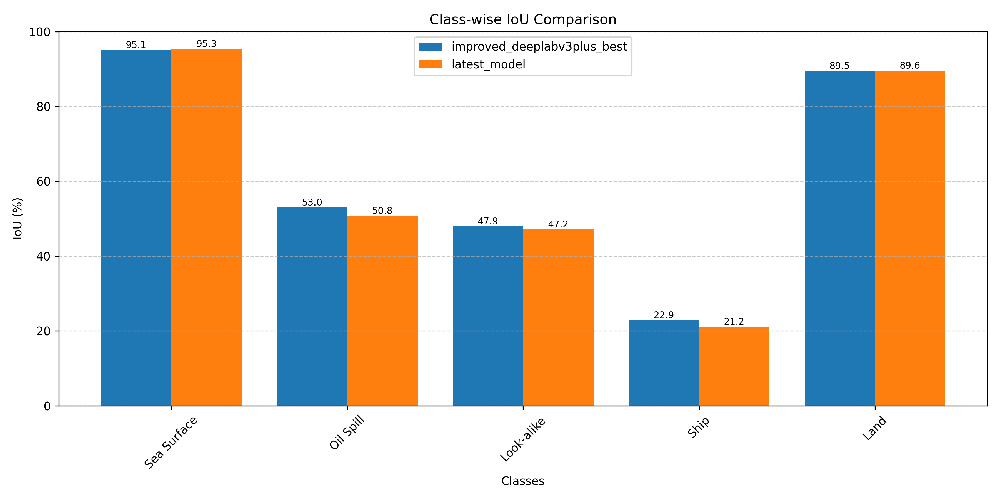

# Oil Spill Detection Model Evaluation Results

Evaluation Date: 2025-04-17 02:49:04

## Mean IoU Comparison

| Model | Mean IoU (%) |
|-------|-------------|
| improved_deeplabv3plus.weights | 61.65 |

## Class-wise IoU Comparison

| Model | Sea Surface | Oil Spill | Look-alike | Ship | Land |
|-------|------|------|------|------|------|
| improved_deeplabv3plus.weights | 95.66 | 48.90 | 50.31 | 22.79 | 90.60 |

## Inference Time Comparison

| Model | Single-Scale (ms) | Multi-Scale (ms) |
|-------|-------------------|------------------|
| improved_deeplabv3plus.weights | 311.73 | 919.86 |

