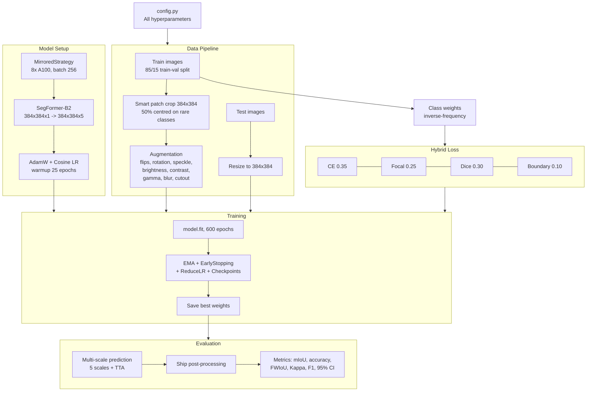

# Oil Spill Detection — How It Works

This document explains the complete training and evaluation pipeline for the SegFormer-B2-based oil spill detection system. It covers every stage from raw SAR images to final evaluation metrics.

---

## Table of Contents

1. [High-Level Overview](#high-level-overview)
2. [Project Structure](#project-structure)
3. [Pipeline Flowchart](#pipeline-flowchart)
4. [Configuration (`config.py`)](#1-configuration-configpy)
5. [Data Loading (`data/data_loader.py`)](#2-data-loading-datadata_loaderpy)
6. [Augmentation (`data/augmentation.py`)](#3-augmentation-dataaugmentationpy)
7. [Loss Functions (`model/loss.py`)](#4-loss-functions-modellosspy)
8. [Training Loop (`train.py`)](#5-training-loop-trainpy)
9. [Evaluation (`evaluate.py`)](#6-evaluation-evaluatepy)
10. [Shared Modules](#7-shared-modules)
11. [Key Design Decisions](#8-key-design-decisions)

---

## High-Level Overview

The system performs **semantic segmentation** on **Synthetic Aperture Radar (SAR)** satellite imagery to identify five classes:

| Class ID | Class Name  | Description                                                   |
| -------- | ----------- | ------------------------------------------------------------- |
| 0        | Sea Surface | Background ocean water                                        |
| 1        | Oil Spill   | Actual petroleum/oil spill regions                            |
| 2        | Look-alike  | Natural phenomena mimicking oil (wind slicks, biogenic films) |
| 3        | Ship        | Vessels visible in SAR imagery                                |
| 4        | Land        | Coastal/land regions                                          |

**Model**: SegFormer-B2 (~27.99M parameters) — a hierarchical transformer encoder with a lightweight MLP decoder. The model itself is **not modified**; all improvements are in the data pipeline, training strategy, and loss functions.

**Hardware**: 8× NVIDIA A100 80 GB GPUs via TensorFlow's `MirroredStrategy`.

---

## Project Structure

```
oil-spill-detection/
├── config.py                    # Central hyperparameter configuration (dataclasses)
├── utils.py                     # Shared utilities (TF import, reproducibility, colours)
├── train.py                     # Training script (distributed, EMA, callbacks)
├── evaluate.py                  # Full evaluation pipeline
├── data/
│   ├── __init__.py
│   ├── data_loader.py           # Train/val/test split, class weights, tf.data pipeline
│   ├── augmentation.py          # SAR-specific augmentation transforms
│   └── test_time_augmentation.py # TTA engine for inference
├── model/
│   ├── __init__.py
│   ├── model.py                 # SegFormer-B2 architecture (unchanged)
│   ├── loss.py                  # Hybrid loss (CE + Focal + Dice + Boundary)
│   ├── metrics.py               # IoU, Pixel Accuracy, FWIoU, Kappa, Bootstrap CI
│   └── prediction.py            # Multi-scale predictor with optional TTA
└── dataset/
    ├── train/
    │   ├── images/              # SAR .jpg images
    │   ├── labels/              # RGB label images
    │   └── labels_1D/           # Single-channel label masks (.png, values 0–4)
    └── test/
        ├── images/
        ├── labels/
        └── labels_1D/
```

---

## Pipeline Flowchart



---

## 1. Configuration (`config.py`)

All hyperparameters are centralised in **dataclasses** so experiments can be managed from a single file:

| Dataclass            | Controls                                                                                          |
| -------------------- | ------------------------------------------------------------------------------------------------- |
| `DataConfig`         | Paths, image size (384×384), val split (15%), class weight cache path                             |
| `AugmentationConfig` | Probabilities and ranges for every augmentation transform                                         |
| `LossConfig`         | CE/Focal/Dice/Boundary weights, focal γ, label smoothing ε                                        |
| `TrainConfig`        | Batch size, LR, warmup epochs, EMA decay, early stopping patience, optimizer params, GPU settings |
| `EvalConfig`         | Scales, TTA settings, ship post-processing thresholds, bootstrap CI params                        |

---

## 2. Data Loading (`data/data_loader.py`)

### Train / Val / Test Split

```
dataset/train/  →  85% for training, 15% for validation  (file-level, deterministic)
dataset/test/   →  100% reserved for final evaluation only
```

This prevents **data leakage** — the test set is never seen during training or used for early stopping / model selection.

### Class Weight Computation

1. All training label `.png` files are read via OpenCV
2. Pixel counts are accumulated per class
3. **Inverse-frequency** weights are computed: `w_c = 1 / freq_c`
4. Weights are normalised to sum to 1.0 and cached to `dataset/class_weights.npy`

This handles the severe class imbalance (sea surface dominates, ships are < 0.1% of pixels).

### Smart Patch Sampling (Training Only)

Training images are loaded at their **original resolution** (no redundant resize to 384×384). A 384×384 patch is then randomly cropped:

- **50% of the time**, the crop is centred on an Oil Spill (class 1) or Ship (class 3) pixel — this up-samples rare classes naturally without duplicating images.
- **50% of the time**, the crop is purely random.

### Pipeline Design

| Feature        | Training                                 | Validation / Test       |
| -------------- | ---------------------------------------- | ----------------------- |
| Resolution     | Original → crop                          | Resized to 384×384      |
| `.cache()`     | **No** (augmentation must be stochastic) | **Yes** (deterministic) |
| Shuffle        | Each epoch (no fixed seed)               | No                      |
| Drop remainder | Yes                                      | Yes                     |

---

## 3. Augmentation (`data/augmentation.py`)

Applied **per-sample** after unbatching, then re-batched. This ensures maximum diversity.

### Augmentation Pipeline (sequential)

| Step | Transform       | Details                                                                                                        | Probability                  |
| ---- | --------------- | -------------------------------------------------------------------------------------------------------------- | ---------------------------- |
| 1    | Horizontal flip | Mirror left-right                                                                                              | 50%                          |
| 2    | Vertical flip   | Mirror top-bottom                                                                                              | 30%                          |
| 3    | Rotation        | Continuous ±15° via affine transform (`ImageProjectiveTransformV3`) with `REFLECT` fill, or exact 90° rotation | 80% continuous, 20% discrete |
| 4    | Speckle noise   | Multiplicative noise `(1 + N(0, σ=0.15))` — models SAR sensor noise                                            | 70%                          |
| 5    | Brightness      | `±0.2` delta                                                                                                   | 40%                          |
| 6    | Contrast        | Factor in `[0.8, 1.2]`                                                                                         | 40%                          |
| 7    | Gamma           | `γ ∈ [0.7, 1.5]` — SAR intensity follows non-linear distributions                                              | 30%                          |
| 8    | Gaussian blur   | 5×5 kernel, `σ ∈ [0.5, 1.5]` — simulates varying sensor resolution                                             | 20%                          |
| 9    | Cutout          | 1–3 rectangular patches erased (5–15% of image each) — forces global context                                   | 30%                          |

**Key**: The rotation uses a true affine transform via `tf.raw_ops.ImageProjectiveTransformV3` instead of only 90° steps. Labels are rotated with nearest-neighbour interpolation to preserve class boundaries.

---

## 4. Loss Functions (`model/loss.py`)

### `HybridSegmentationLoss`

A weighted combination of four complementary losses, all applied to **label-smoothed** one-hot targets:

```
Total Loss = 0.35 · CE + 0.25 · Focal + 0.3 · Dice + 0.1 · Boundary
```

#### Components

| Loss                       | Weight | Purpose                                                                                                                                                                               |
| -------------------------- | ------ | ------------------------------------------------------------------------------------------------------------------------------------------------------------------------------------- |
| **Weighted Cross-Entropy** | 0.35   | Pixel-level classification; class weights handle imbalance                                                                                                                            |
| **Focal Loss** (γ = 2.0)   | 0.25   | Down-weights easy examples, focuses on hard pixels (boundaries, rare classes). Modulator applied to **unweighted** CE, then class weights added (fixes previous double-weighting bug) |
| **Dice Loss**              | 0.30   | Region-level overlap; directly optimises F1-like score per class                                                                                                                      |
| **Boundary Loss**          | 0.10   | Sobel-based edge detection on labels → edge-aware cross-entropy. Boosted 2.5× at boundaries for sharper predictions                                                                   |

#### Label Smoothing

One-hot targets are smoothed: `y_smooth = y · (1 - ε) + ε / K` where ε = 0.1 and K = 5 classes. This prevents overconfident predictions and improves generalisation.

---

## 5. Training Loop (`train.py`)

### Distributed Training

```python
strategy = tf.distribute.MirroredStrategy()  # 8× A100
global_batch_size = 32 × 8 = 256
```

All model creation, compilation, and weight loading happen inside `strategy.scope()`.

### Learning Rate Schedule

```
LR = 3e-5 × √(256/2) ≈ 3.4e-4   (square-root scaling rule)
```

| Phase        | Epochs | Behaviour                                    |
| ------------ | ------ | -------------------------------------------- |
| Warmup       | 0–25   | Linear ramp from 0 → 3.4e-4                  |
| Cosine decay | 25–600 | Cosine annealing to `α_min = 0.001 × 3.4e-4` |

Additionally, **ReduceLROnPlateau** halves the LR if `val_iou_metric` doesn't improve for 15 epochs.

### EMA (Exponential Moving Average)

- After every training step: `θ_ema = 0.999 · θ_ema + 0.001 · θ`
- Before validation: EMA weights are swapped in
- After validation: original weights restored
- After training finishes: EMA weights applied permanently before saving

This produces smoother, better-generalising weights.

### Callbacks

| Callback                 | Monitors               | Action                                   |
| ------------------------ | ---------------------- | ---------------------------------------- |
| ModelCheckpoint (best)   | `val_iou_metric` (max) | Save best weights                        |
| ModelCheckpoint (latest) | Every epoch            | Save for resume                          |
| EarlyStopping            | `val_iou_metric`       | Stop after 30 epochs without improvement |
| ReduceLROnPlateau        | `val_iou_metric`       | Halve LR after 15 plateau epochs         |
| TensorBoard              | —                      | Log training/validation curves           |
| EMACallback              | —                      | Swap weights for validation              |
| ProgressCallback         | —                      | Print step times, loss, IoU, ETA         |

### Post-Training

After training completes:

1. EMA weights applied permanently
2. Final weights saved
3. Training curves plotted
4. TTA evaluation run on the **validation** set for a quick quality check

---

## 6. Evaluation (`evaluate.py`)

### Multi-Scale Prediction

The `MultiScalePredictor` processes each image at multiple scales:

```
Scales (with TTA):    [0.50, 0.75, 1.00, 1.25, 1.50]
Scales (without TTA): [0.75, 1.00, 1.25]
```

At each scale:

1. **Resize** the image to the scaled resolution
2. **Resize again** to model input (384×384)
3. **Forward pass** (or TTA if enabled)
4. **Resize predictions** back to original resolution
5. **Average** softmax probabilities across all scales
6. Convert back to logits

### Test-Time Augmentation (TTA)

When enabled, each forward pass is replaced by an ensemble of 8 augmented copies:

- Original image
- Horizontal flip
- Vertical flip
- Both flips
- 90°, 180°, 270° rotations
- Combined flip + rotation

Predictions are de-augmented (inverse transform) and averaged.

### Ship Post-Processing

A morphology-based refinement specifically for the tiny Ship class:

1. Threshold ship probabilities at 0.25
2. Opening → Closing (clean noise)
3. Connected component analysis (reject area < 8 pixels)
4. Dilate small components (< 100 px) for better visibility
5. Boost ship probability by 1.35× in refined regions
6. Suppress look-alike probability by 0.7× where ship detected
7. Re-normalise probabilities

### Metrics Computed

| Metric                      | Description                                                                        |
| --------------------------- | ---------------------------------------------------------------------------------- |
| **Mean IoU**                | Average Intersection-over-Union across present classes                             |
| **Class-wise IoU**          | Per-class IoU for all 5 classes                                                    |
| **Pixel Accuracy**          | Correctly classified pixels / total pixels                                         |
| **FWIoU**                   | Frequency-Weighted IoU (accounts for class prevalence)                             |
| **Cohen's Kappa**           | Agreement beyond chance (κ > 0.8 = near-perfect)                                   |
| **Precision / Recall / F1** | Per-class, derived from confusion matrix                                           |
| **95% Bootstrap CI**        | Confidence interval via 1000 image-level resamples (vectorised with `np.bincount`) |
| **Inference Time**          | Mixed-precision vs FP32 comparison                                                 |

---

## 7. Shared Modules

### `utils.py`

- `silent_tf_import()` — Suppresses TensorFlow startup noise by redirecting stderr
- `set_reproducibility(seed)` — Sets `PYTHONHASHSEED`, `TF_DETERMINISTIC_OPS`, `random.seed`, `np.random.seed`, `tf.random.set_seed`
- `TermColors` / `colored_print()` — ANSI terminal colours

### `model/metrics.py`

- `IoUMetric` — Keras metric wrapping `MeanIoU` for `model.compile()`
- `compute_iou()` — Standalone confusion-matrix-based IoU
- `compute_precision_recall_f1()` — From confusion matrix
- `compute_pixel_accuracy()` — Overall accuracy
- `compute_frequency_weighted_iou()` — Weighted by class frequency
- `compute_cohens_kappa()` — Inter-rater agreement statistic
- `compute_bootstrap_ci()` — **Vectorised** with `np.bincount` (10–100× faster than the original pixel-level loop)

### `model/prediction.py`

- `MultiScalePredictor` — Handles multi-scale inference, optional TTA integration, channel mismatch correction, and graceful fallback if a scale fails

---

## 8. Key Design Decisions

### Why No `.cache()` on Training Data?

Augmentation is stochastic — every epoch should produce fresh random transforms. If you cache after augmentation, you train on the same augmented copies every epoch, defeating the purpose.

### Why Square-Root LR Scaling?

Linear LR scaling (`LR × batch_ratio`) is too aggressive for batch 256. The square-root rule `LR × √(batch_ratio)` provides a gentler increase that maintains training stability:

```
3e-5 × √(256/2) = 3e-5 × √128 ≈ 3.4e-4
```

### Why 25-Epoch Warmup?

Large-batch training starts with noisy parameter updates. A long warmup (25 of 600 epochs ≈ 4%) lets the model settle into a stable loss landscape before the LR reaches its peak.

### Why EMA?

Exponential Moving Average creates a "smoother" copy of the weights that averages out the noise from SGD updates. This consistently improves generalisation by 0.5–2% IoU on segmentation tasks.

### Why Boundary Loss?

Standard CE/Dice treat all pixels equally. Boundary loss adds extra supervision at class edges (detected by Sobel filters), which sharpens predictions along oil spill boundaries — critical for accurate area estimation.

### Why Label Smoothing?

With 5 classes and severe imbalance, the model tends to become overconfident on majority classes. Smoothing (ε = 0.1) prevents logits from growing unbounded and acts as soft regularisation.

### Why Smart Patch Sampling?

Ships occupy < 0.1% of total pixels. Purely random crops often contain zero ship pixels. By centring 50% of crops on rare-class pixels, the model sees meaningful minority-class samples every batch without explicit oversampling.
